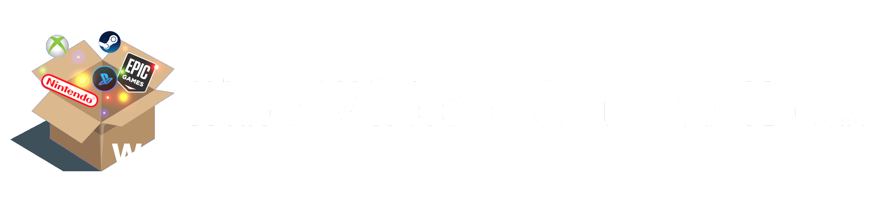

<h1 align="center">
   
  
</h1>

# The VideoGameBox Web

The VideoGameBox Web es una aplicación web enfocada a aquellas personas que quieren informarse sobre videojuegos y quieren poder gestionarlos y organizarlos de una manera sencilla.

## Información

La aplicación The VideoGameBox Web es una extensión de la aplicación de escritorio [The VideoGameBox](https://github.com/CGLMaster/TheVideoGameBox).

Los videojuegos fueron extraídos de [IGDB API](https://api-docs.igdb.com/#examples), la cual es una API que proporciona información sobre cualquier juego existente. Para ello realizamos una extracción de los juegos con su respectiva información mediante Phyton.

Toda la información se guarda en una base de MongoDB local importando los videojuegos con formato JSON. En la colección hay almacenados 10000 juegos.
Para poder obtener la información de la base de datos empleo la relación entre node.js y mongoose, empleando para ello esquemas.

## ¿Cómo funciona? --> Actualmente sigue en desarrollo

Para demostrar su funcionamiento dejo un video de la demo del proyecto en la cual se ven todos los aspectos que se pueden realizar.

  

## Propietario

* **Carlos** Gómez López
